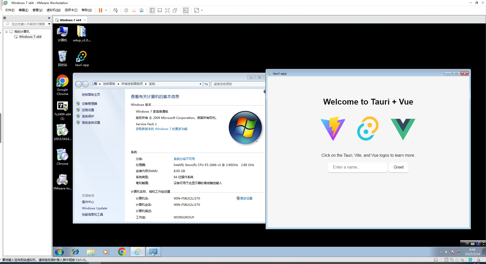

# Tauri + Vue 3

这个模板将帮助您快速开始使用 Tauri + Vue 3 + Vite 进行开发。兼容win7

## 适配win7需要的改动

### rust降级

1.77.2

## 打包问题参考

[从零开始的 Tauri 开发 & 打包成 exe 【Windows 平台】](https://blog.csdn.net/u010263423/article/details/136006546)
